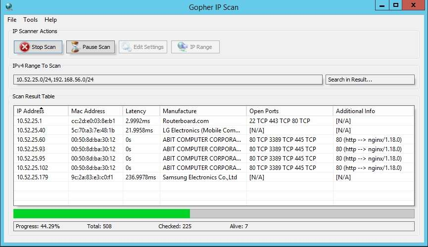
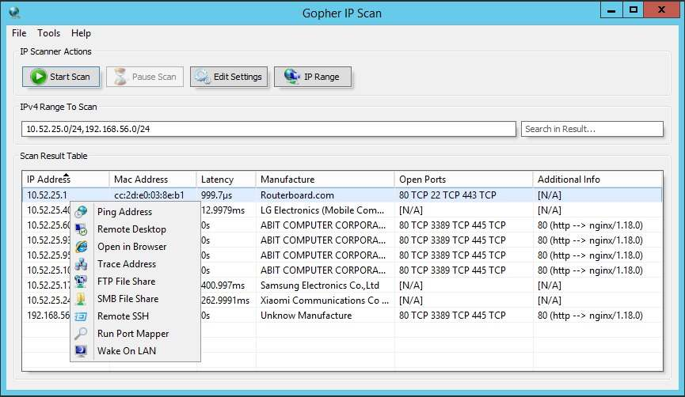
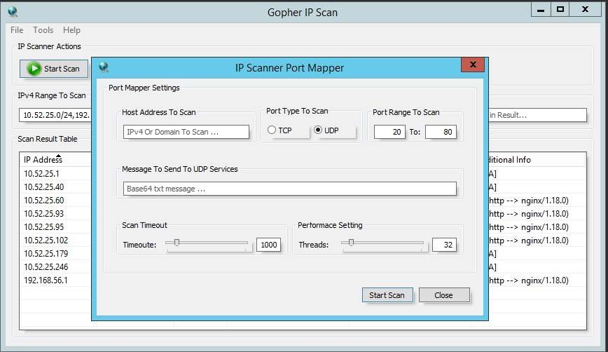
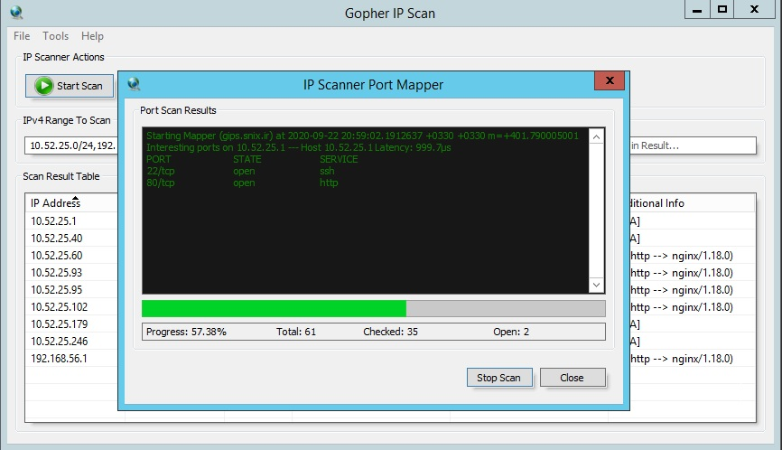

# Gopher IP Scan
***If you've come here looking to simply run Gopher Scan on windows, [you may download it here](https://gips.snix.ir).***  
Windows GUI tool for scanning networks written in Golang, Core features:  
scan alive host, fast port mapper, built-in ssh client and wake on lan  
friendly user interface, run on windows 7, 8.1, 10   


### Compile on Windows
Get rsrc tool and append it to windows path env:  
```
go get github.com/akavel/rsrc
set PATH=%PATH%;C:\Golang\bin\
```
Generate rsrc.syso file: `rsrc -manifest manifest.xml -ico scanicon.ico -o rsrc.syso`  
Build exe binary: `go build -ldflags -H=windowsgui -o "Gopher IP Scan.exe"`

### Gohper ScreenShots
   
